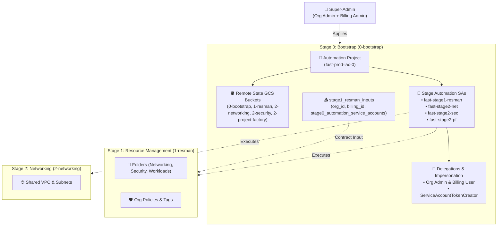

# Google Cloud Foundation Fabric (FAST) - Stage 0 (Bootstrap) Example

This directory provides a clean, self-contained Terraform example implementing **Google FAST Stage 0** (**Bootstrap** / `0-bootstrap`).

---

## 1. Role in Google FAST Architecture

**Stage 0 (Bootstrap)** is the foundational entry point of the entire landing zone. It is executed once by a human **Super-Administrator** possessing `roles/resourcemanager.organizationAdmin` and `roles/billing.admin`.

Its primary mission is to establish the automated CI/CD and Terraform infrastructure, eliminating the need for long-lived human administrative credentials or static service account keys in downstream stages:



---

## 2. What Stage 0 Provisions

1. **Seed Automation Project**:
   - Created directly under the GCP Organization.
   - Houses stage automation service accounts and remote Terraform state buckets.
   - Enables core infrastructure APIs: `cloudresourcemanager`, `iam`, `storage`, `cloudbilling`, `serviceusage`, `logging`, `monitoring`.

2. **Isolated GCS Remote State Buckets**:
   - Individual Cloud Storage buckets provisioned for each stage (`0-bootstrap`, `1-resman`, `2-networking`, `2-security`, `2-project-factory`).
   - Hardened with **Object Versioning**, **Uniform Bucket-Level Access (UBLA)**, and **Public Access Prevention (`enforced`)**.
   - Least-privilege IAM: each stage service account is granted `roles/storage.objectAdmin` only on its own state bucket.

3. **Stage Automation Service Accounts**:
   - `fast-stage1-resman`: Manages resource hierarchy (folders, org policies, hierarchical tags) in Stage 1.
   - `fast-stage2-net`: Manages Shared VPCs, host projects, subnets, routers, and firewalls in Stage 2.
   - `fast-stage2-sec`: Manages KMS encryption keys, Certificate Authority Service (CAS), and secrets.
   - `fast-stage2-pf`: Provisions application workload projects and attaches them to Shared VPCs in Stage 3.

4. **Organization and Billing IAM Grants**:
   - Binds `roles/billing.user` on the billing account to the stage automation service accounts.
   - Binds organization management roles (`organizationAdmin`, `folderAdmin`, `tagAdmin`, `xpnAdmin`) to designated stage SAs.

5. **Token Creator Impersonation**:
   - Grants administrator groups `roles/iam.serviceAccountTokenCreator` on the stage service accounts.
   - Downstream stages can impersonate these service accounts directly via `provider "google" { impersonate_service_account = ... }` without creating or exporting JSON private keys.

6. **Workload Identity Federation (WIF) for GitHub Actions**:
   - Provisions a dedicated Workload Identity Pool (`fast-github-pool`) and GitHub OIDC Provider.
   - Restricts authentication conditions to the designated GitHub repository.
   - Binds `roles/iam.workloadIdentityUser` to all stage automation service accounts, enabling keyless CI/CD.

7. **Stage Contract Outputs**:
   - Emits `stage1_resman_inputs` containing `organization_id`, `billing_account_id`, `prefix`, and `stage0_automation_service_accounts` ready for consumption by Stage 1.
   - Emits `workload_identity_provider` to easily configure GitHub Secrets.

---

## 3. File Structure

| File | Purpose |
| :--- | :--- |
| [`versions.tf`](./versions.tf) | Terraform version `>= 1.5.0`, provider pins, and backend migration notes |
| [`variables.tf`](./variables.tf) | Input variables for organization, billing, admin groups, WIF, and storage location |
| [`project.tf`](./project.tf) | Seed automation project creation and API enablement |
| [`storage.tf`](./storage.tf) | GCS remote state buckets with versioning, UBLA, and stage SA access |
| [`iam.tf`](./iam.tf) | Stage service accounts, organization IAM, billing IAM, and impersonation |
| [`wif.tf`](./wif.tf) | Workload Identity Pool, GitHub OIDC Provider, and keyless CI/CD delegation |
| [`outputs.tf`](./outputs.tf) | Exported automation project ID, state buckets, WIF provider name, and Stage 1 contract |
| [`terraform.tfvars.example`](./terraform.tfvars.example) | Example variable values including WIF settings |
| [`fabric_module_example.tf.example`](./fabric_module_example.tf.example) | Reference using Cloud Foundation Fabric `modules/project` and `modules/gcs` |


---

## 4. How to Use

### Step 1: Prepare Variables
Copy `terraform.tfvars.example` to `terraform.tfvars`:
```bash
cp terraform.tfvars.example terraform.tfvars
```
Set your `organization_id`, `billing_account_id`, and `admin_principals`.

### Step 2: Initialize and Apply
Because this is Stage 0, it runs with local state initially using the superadmin identity:
```bash
terraform init
terraform plan
terraform apply
```

### Step 3: (Production) Migrate State to GCS
Once the `0-bootstrap` state bucket is created, uncomment the `backend "gcs"` block in [`versions.tf`](./versions.tf) with the generated bucket name, and run:
```bash
terraform init -migrate-state
```

### Step 4: Export Contract Outputs to Stage 1 (Resource Management)
Export the contract object directly into the root Stage 1 folder:
```bash
terraform output -json stage1_resman_inputs > ../1-resman.auto.tfvars.json
```
Navigate to the root directory and proceed with Stage 1:
```bash
cd ..
terraform init
terraform plan
terraform apply
```
Stage 1 will consume the service accounts created here in Stage 0 and delegate folder permissions to them.
