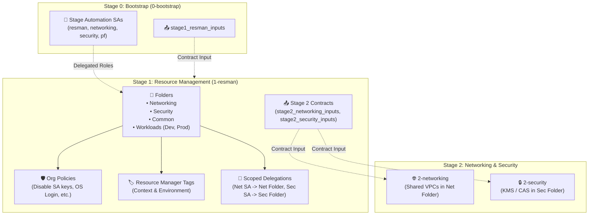

# Google Cloud Foundation Fabric (FAST) - Stage 1 (Resource Management) Example

This directory provides a clean, self-contained Terraform example implementing **Google FAST Stage 1** (**Resource Management** / `1-resman`).

---

## 1. Role in Google FAST Architecture

Stage 1 is executed by the **Resource Management service account** (`fast-stage1-resman`) created during Stage 0 (Bootstrap).

It consumes the Stage 0 contract outputs (`stage0_automation_service_accounts`) and builds the foundational GCP resource hierarchy, applies baseline organization security policies, binds hierarchical tags, and delegates scoped permissions to downstream stage service accounts:



---

## 2. What Stage 1 Provisions

1. **Resource Hierarchy Creation (Folders)**:
   - `Networking` folder: Houses Shared VPC host projects, interconnects, and routers.
   - `Security` folder: Centralized KMS encryption keys, Certificate Authority Service (CAS), and Secret Manager.
   - `Common` folder: Shared tooling, CI runners, and artifact registries.
   - `Workloads` folder: Sub-folders for `Development` and `Production` application environments.

2. **IAM Delegation (Least Privilege)**:
   - Grants the **Networking Automation SA** permissions on the `Networking` folder (`roles/compute.xpnAdmin`, `roles/resourcemanager.folderAdmin`, `roles/resourcemanager.projectCreator`).
   - Grants the **Security Automation SA** permissions on the `Security` folder (`roles/cloudkms.admin`, `roles/resourcemanager.folderAdmin`, `roles/resourcemanager.projectCreator`).
   - Grants the **Project Factory SA** permissions on the `Workloads` folder (`roles/resourcemanager.projectCreator`).

3. **Organization Policies (Guardrails)**:
   - `iam.disableServiceAccountKeyCreation`: Prevents downloading static SA keys; enforces Workload Identity and short-lived credentials.
   - `compute.disableSerialPortAccess`: Prevents interactive serial console access to VMs.
   - `compute.requireOsLogin`: Enforces centralized IAM-based OS Login SSH authentication.
   - `iam.automaticIamGrantsForDefaultServiceAccounts`: Prevents broad Editor roles from being granted automatically to default service accounts.

4. **Resource Manager Hierarchical Tags**:
   - Tag keys for `context` (`networking`, `security`, `workloads`) and `environment` (`development`, `production`).
   - Attached to corresponding folders for conditional IAM and audit controls.

5. **Stage Contract Outputs**:
   - Emits folder IDs and configuration contracts ready for ingestion by downstream Stage 2 (`stage2_networking_inputs`, `stage2_security_inputs`, `stage2_project_factory_inputs`).

---

## 3. File Structure

| File | Purpose |
| :--- | :--- |
| [`versions.tf`](./versions.tf) | Terraform required version, Google providers, and impersonation settings |
| [`variables.tf`](./variables.tf) | Input variables (org ID, billing account, stage 0 automation SAs, admin groups) |
| [`folders.tf`](./folders.tf) | Google Cloud folder definitions (Networking, Security, Common, Workloads) |
| [`iam.tf`](./iam.tf) | Scoped IAM delegations to downstream stage automation SAs and admin groups |
| [`org_policies.tf`](./org_policies.tf) | Baseline security organization policies |
| [`tags.tf`](./tags.tf) | Hierarchical Resource Manager Tag keys, values, and folder bindings |
| [`outputs.tf`](./outputs.tf) | Exported folder IDs and Stage 2 contract variables |
| [`terraform.tfvars.example`](./terraform.tfvars.example) | Example variable values |
| [`fabric_module_example.tf.example`](./fabric_module_example.tf.example) | Reference using Cloud Foundation Fabric `modules/folder` |

---

## 4. How to Use

### Step 1: Ingest Outputs from Stage 0 (or Prepare Variables)
If you deployed [`0-bootstrap`](../0-bootstrap), export its outputs directly into Stage 1:
```bash
cd ../0-bootstrap
terraform output -json stage1_resman_inputs > ../1-resman/1-resman.auto.tfvars.json
cd ../1-resman
```
Otherwise, copy `terraform.tfvars.example` to `terraform.tfvars`:
```bash
cp terraform.tfvars.example terraform.tfvars
```
Update values for `organization_id`, `billing_account_id`, and `stage0_automation_service_accounts`.

### Step 2: Initialize Terraform
```bash
terraform init
```

### Step 3: Review Plan
```bash
terraform plan
```

### Step 4: Apply Configuration
```bash
terraform apply
```

### Step 5: Export Outputs to Stage 2
Stage 1 outputs the folder IDs and parameters required by Stage 2:
```bash
terraform output -json stage2_networking_inputs > ../2-networking/2-networking.auto.tfvars.json
```
Navigate to [`2-networking`](../2-networking) to deploy the Shared VPC and networking infrastructure.
