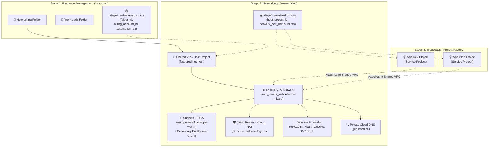

# Google Cloud Foundation Fabric (FAST) - Stage 2 (Networking) Example

This directory provides a clean, self-contained Terraform example implementing **Google FAST Stage 2** (**Networking** / `2-networking`).

---

## 1. Role in Google FAST Architecture

In Google Cloud Foundation Fabric (FAST), networking is separated into its own stage managed by the **Networking Automation Service Account** (`fast-stage2-net`).

Stage 2 consumes the `Networking` folder provisioned by Stage 1 (`1-resman`) and establishes the enterprise connectivity foundation:



---

## 2. What Stage 2 Provisions

1. **Dedicated Shared VPC Host Project**:
   - Resides inside the `Networking` folder created in Stage 1.
   - Enables essential APIs: `compute.googleapis.com`, `dns.googleapis.com`, `servicenetworking.googleapis.com`, `logging.googleapis.com`, `monitoring.googleapis.com`.
   - Enabled as a Shared VPC Host (`google_compute_shared_vpc_host_project`).

2. **Enterprise Shared VPC Network**:
   - Custom-mode VPC (`auto_create_subnetworks = false`) with `GLOBAL` routing mode.

3. **Subnets with Enterprise Defaults**:
   - **Private Google Access (PGA)** enabled across all subnets, allowing private VMs and serverless runtimes to reach Google APIs (Cloud Storage, BigQuery, Artifact Registry) without public IPs.
   - **Secondary IP ranges** configured for Kubernetes (GKE Pods and Services CIDRs).
   - Optional VPC Flow Logs for network observability and audit trails.

4. **Cloud Router & Cloud NAT**:
   - Managed NAT gateways deployed in active regions.
   - Provides secure internet egress for package managers, container registries, and updates without assigning public IP addresses to compute resources.

5. **Baseline Security Firewall Rules**:
   - `fw-allow-internal`: Cross-subnet traffic across internal RFC1918 ranges (`10.0.0.0/8`, `172.16.0.0/12`, `192.168.0.0/16`).
   - `fw-allow-health-checks`: Google Cloud load balancer probes (`35.191.0.0/16`, `130.211.0.0/22`).
   - `fw-allow-iap`: Google Cloud Identity-Aware Proxy (IAP) range (`35.235.240.0/20`) for secure, bastionless SSH and RDP.

6. **Private Cloud DNS Zone**:
   - Private managed zone (e.g. `gcp.internal.`) associated with the Shared VPC for internal service discovery.

7. **Stage 3 Contract Outputs**:
   - Emits `stage3_workload_inputs` containing `host_project_id`, `network_self_link`, and `subnet_self_links`, which downstream workload project factories consume to attach service projects and assign subnet permissions (`roles/compute.networkUser`).

---

## 3. File Structure

| File | Purpose |
| :--- | :--- |
| [`versions.tf`](./versions.tf) | Terraform version, Google providers, and impersonation settings |
| [`variables.tf`](./variables.tf) | Input variables matching Stage 1 outputs and networking configuration |
| [`project.tf`](./project.tf) | Host project creation, API enablement, and Shared VPC host declaration |
| [`vpc.tf`](./vpc.tf) | Shared VPC network definition |
| [`subnets.tf`](./subnets.tf) | Subnets, Private Google Access, secondary GKE IP ranges, flow logs |
| [`nat.tf`](./nat.tf) | Regional Cloud Routers and Cloud NAT gateways |
| [`firewall.tf`](./firewall.tf) | Baseline security firewall rules (RFC1918, health checks, IAP) |
| [`dns.tf`](./dns.tf) | Internal Private Cloud DNS zone bound to the Shared VPC |
| [`outputs.tf`](./outputs.tf) | Network IDs, subnet self-links, and Stage 3 workload contract |
| [`terraform.tfvars.example`](./terraform.tfvars.example) | Example variable values |
| [`fabric_module_example.tf.example`](./fabric_module_example.tf.example) | Reference using Cloud Foundation Fabric `modules/net-vpc` |

---

## 4. How to Use

### Step 1: Ingest Outputs from Stage 1
From the root of this repository (where Stage 1 was applied), generate the auto tfvars file for Stage 2:

```bash
terraform output -json stage2_networking_inputs > 2-networking/2-networking.auto.tfvars.json
```

Because Terraform automatically loads `*.auto.tfvars.json` files, the Stage 1 outputs (`folder_id`, `billing_account_id`, `automation_sa`) will be populated automatically without manual copy-pasting.

### Step 2: Initialize Terraform
Navigate to the `2-networking` directory:

```bash
cd 2-networking
terraform init
```

### Step 3: Review Plan
```bash
terraform plan
```

### Step 4: Apply Configuration
```bash
terraform apply
```

### Step 5: Export Outputs for Stage 3 (Workloads / Project Factory)
```bash
terraform output -json stage3_workload_inputs > ../3-workloads.auto.tfvars.json
```
Downstream application project factories will use this file to attach service projects to the Shared VPC host project and grant application service accounts permission to deploy VMs and GKE clusters onto the subnets.
