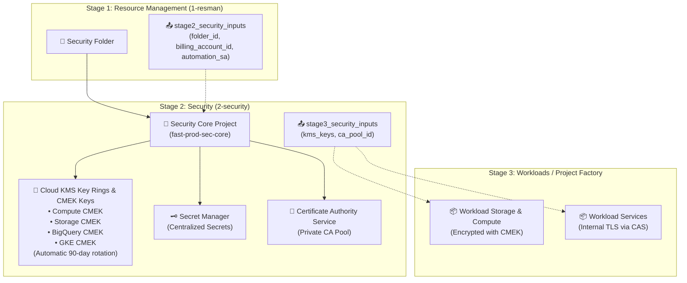

# Google Cloud Foundation Fabric (FAST) - Stage 2 (Security) Example

This directory provides a clean, self-contained Terraform example implementing **Google FAST Stage 2** (**Security** / `2-security`).

---

## 1. Role in Google FAST Architecture

In Google Cloud Foundation Fabric (FAST), the security foundation is separated into its own stage managed by the **Security Automation Service Account** (`fast-stage2-sec`).

Stage 2 consumes the `Security` folder provisioned by Stage 1 (`1-resman`) and establishes centralized cryptography, secrets management, and private certificate authority services:



---

## 2. What Stage 2 Provisions

1. **Dedicated Security Core Project**:
   - Resides inside the `Security` folder created in Stage 1.
   - Enables essential security APIs: `cloudkms.googleapis.com`, `secretmanager.googleapis.com`, `privateca.googleapis.com`, `logging.googleapis.com`, `monitoring.googleapis.com`.

2. **Centralized Cloud KMS (Key Management Service)**:
   - Regional Key Rings provisioned across active regions (e.g. `europe-west1`, `europe-west4`).
   - Customer-Managed Encryption Keys (**CMEK**) with automated key rotation (default: 90 days / `7776000s`) for:
     - `compute`: Disk encryption for Compute Engine and GKE nodes.
     - `storage`: Bucket encryption for Cloud Storage.
     - `bigquery`: Dataset encryption for BigQuery tables.
     - `gke`: Application-layer secrets encryption for Kubernetes clusters.

3. **Centralized Secret Manager**:
   - Central storage for infrastructure secrets with automatic multi-regional replication and environment labeling.

4. **Certificate Authority Service (CAS)**:
   - Private CA Pool configured for issuing internal certificates (mTLS, internal microservices HTTPS) without relying on external public CAs.

5. **Stage 3 Contract Outputs**:
   - Emits `stage3_security_inputs` containing the CMEK key URIs and CA pool identifiers, enabling downstream workload project factories to configure encryption bindings.

---

## 3. File Structure

| File | Purpose |
| :--- | :--- |
| [`versions.tf`](./versions.tf) | Terraform version `>= 1.5.0`, provider pins, and impersonation settings |
| [`variables.tf`](./variables.tf) | Input variables matching Stage 1 contracts and security settings |
| [`project.tf`](./project.tf) | Security core project creation and API enablement |
| [`kms.tf`](./kms.tf) | Regional Key Rings and CMEK keys with rotation periods |
| [`secret_manager.tf`](./secret_manager.tf) | Centralized Secret Manager secrets |
| [`ca_service.tf`](./ca_service.tf) | Private CA Pool for internal certificate issuance |
| [`outputs.tf`](./outputs.tf) | Exported KMS key URIs, secret IDs, and Stage 3 contract |
| [`terraform.tfvars.example`](./terraform.tfvars.example) | Example variable values |
| [`fabric_module_example.tf.example`](./fabric_module_example.tf.example) | Reference using Cloud Foundation Fabric `modules/kms` |

---

## 4. How to Use

### Step 1: Ingest Outputs from Stage 1
From the root of this repository (where Stage 1 was applied), export the contract outputs for Stage 2 Security:

```bash
cd 1-resman
terraform output -json stage2_security_inputs > ../2-security/2-security.auto.tfvars.json
cd ../2-security
```

Terraform automatically reads `2-security.auto.tfvars.json`, populating `folder_id`, `billing_account_id`, and `automation_sa`.

### Step 2: Initialize Terraform
```bash
terraform init
```

### Step 3: Review Plan
```bash
terraform plan
```

### Step 4: Apply Configuration
```bash
terraform apply
```

### Step 5: Export Outputs for Stage 3 (Workloads / Project Factory)
```bash
terraform output -json stage3_security_inputs > ../3-security.auto.tfvars.json
```
Downstream workload factories use this file to grant application service accounts `roles/cloudkms.cryptoKeyEncrypterDecrypter` on these CMEK keys to encrypt disks, buckets, and databases.
