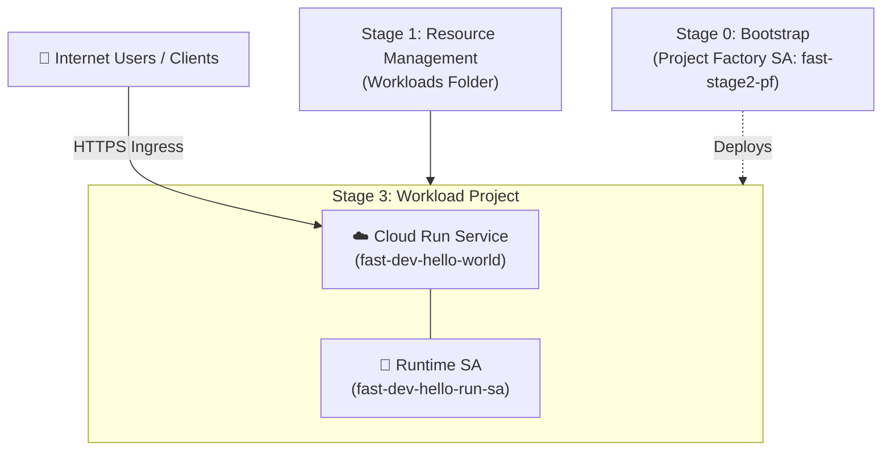

# Google Cloud Foundation Fabric (FAST) - Stage 3 (Workloads) Cloud Run Example

This directory provides a clean, modular Terraform implementation of **Google FAST Stage 3** (**Workloads** / `3-workloads`), deploying a containerized **Hello World application on Cloud Run**.

---

## 1. Role in Google FAST Architecture

**Stage 3 (Workloads)** is where application-level workloads run on top of the foundation created in previous stages:
- Resides inside the `Workloads` folder created in Stage 1 ([`1-resman`](../1-resman)).
- Deployed via the dedicated **Project Factory / Workloads Service Account** (`fast-stage2-pf`) provisioned in Stage 0 ([`0-bootstrap`](../0-bootstrap)).
- Runs under its own isolated Google Cloud project (`fast-dev-app-xxxx`) without administrative access to the landing zone hierarchy, networking host projects, or KMS keyrings.



---

## 2. Container Images on Cloud Run

### Docker Hub `hello-world` vs. Cloud Run HTTP Requirement
Cloud Run is a managed serverless platform for web applications and APIs that expects container instances to start an **HTTP web server listening on the port defined by `$PORT`** (default `8080`).

- **Docker Hub [`hello-world`](https://hub.docker.com/_/hello-world)** (`docker.io/library/hello-world`):
  A minimal CLI diagnostic container that prints `"Hello from Docker!"` to standard output and immediately exits with status code 0. If deployed to Cloud Run, container startup fails because no HTTP port is bound.
- **Cloud Run Compatible Images**:
  - `us-docker.pkg.dev/cloudrun/container/hello`: Google Cloud's official Cloud Run hello-world HTTP server (default in this template).
  - `docker.io/nginxdemos/hello`: Docker Hub's NGINX-based hello-world web server.

The image is fully configurable via the `container_image` variable.

---

## 3. Resources Provisioned

1. **Workload Application Project**:
   - Created in the designated Workloads folder (`folder_id`).
   - Attached to the Organization billing account.
   - Enables core APIs: `run.googleapis.com`, `compute.googleapis.com`, `iam.googleapis.com`, `logging.googleapis.com`, `monitoring.googleapis.com`.

2. **Dedicated Cloud Run Runtime Service Account**:
   - `fast-dev-hello-run-sa`: Follows least-privilege principles by giving the container only the permissions it needs.

3. **Cloud Run v2 Service**:
   - Autoscaling configured (`min_instance_count = 0` to scale down to zero when idle, saving cost; `max_instance_count = 5`).
   - CPU and memory allocations (`1` vCPU, `512Mi` RAM).
   - Ingress configured to allow all external traffic.

4. **Public Invocation IAM**:
   - Configured with `roles/run.invoker` for `allUsers` when `allow_unauthenticated = true`.

---

## 4. File Structure

| File | Purpose |
| :--- | :--- |
| [`versions.tf`](./versions.tf) | Terraform version `>= 1.5.0` and Google provider constraints |
| [`variables.tf`](./variables.tf) | Input variables for folder, billing, image, scaling, and region |
| [`project.tf`](./project.tf) | Workload application project creation and API activation |
| [`cloud_run.tf`](./cloud_run.tf) | Cloud Run v2 service, runtime SA, and invoker IAM policy |
| [`outputs.tf`](./outputs.tf) | Public HTTPS service URL, project ID, and service details |
| [`terraform.tfvars`](./terraform.tfvars) | GitOps configuration file |
| [`terraform.tfvars.example`](./terraform.tfvars.example) | Example variable configuration |

---

## 5. How to Deploy

### Local Deployment
```bash
cd 3-workloads
terraform init
terraform plan
terraform apply
```

### CI/CD Deployment
This stage is fully integrated with GitHub Actions via [`.github/workflows/stage-3-workloads.yml`](../.github/workflows/stage-3-workloads.yml). Pull requests automatically run `terraform plan`, and merges to `main` trigger `terraform apply`.
