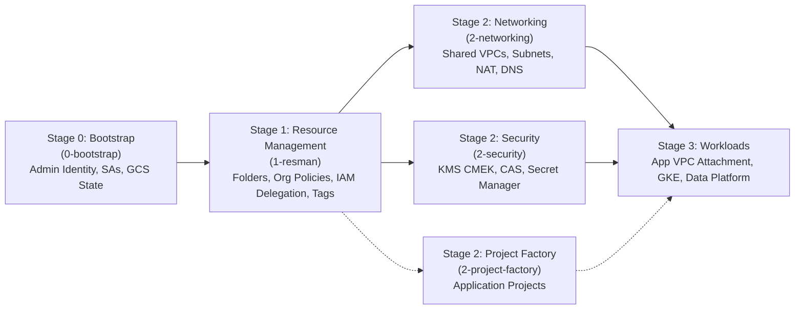
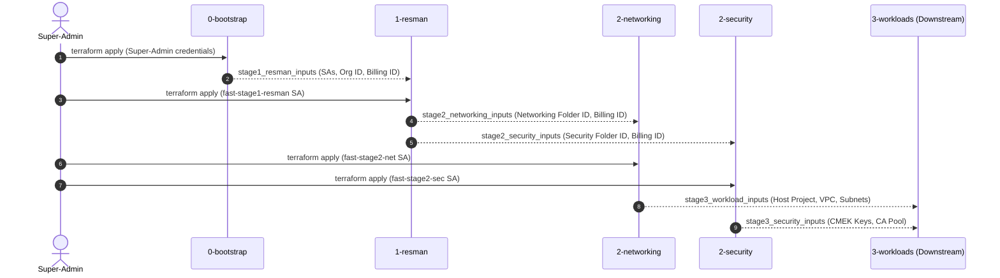
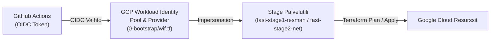

# Google Cloud Foundation Fabric (FAST) - Enterprise Landing Zone

This repository provides clean, modular, and self-contained Terraform implementations of the core stages of **Google Cloud Foundation Fabric (FAST)**.

---

## 1. What is Google FAST?

**FAST (Foundations Architecture Setup and Templates)** is Google Cloud's opinionated, enterprise-grade framework for building landing zones using Infrastructure-as-Code (Terraform), maintained under [Cloud Foundation Fabric](https://github.com/GoogleCloudPlatform/cloud-foundation-fabric).

FAST structures Google Cloud landing zones into discrete, sequential stages designed around two core principles:

1. **Separation of Duties & Least Privilege**: Each stage runs under its own dedicated Service Account with strictly scoped IAM permissions. No stage requires broad, permanent Super-Admin privileges after initial bootstrap.
2. **Decoupled Stage Contracts**: Stages communicate via structured JSON contract outputs rather than hardcoded references or tightly coupled remote state. A stage outputs what downstream stages need, which are ingested as Terraform variables (`*.auto.tfvars.json`).



---

## 2. Detailed Description of Implemented Stages

### Stage 0: Bootstrap ([`0-bootstrap/`](./0-bootstrap))
* **Purpose**: Bootstraps the landing zone's CI/CD automation and state storage infrastructure.
* **Execution Identity**: Executed once by a human **Super-Admin** holding `roles/resourcemanager.organizationAdmin` and `roles/billing.admin`.
* **Key Resources Created**:
  * **Automation Seed Project** (`fast-prod-iac-0`): Root project directly under the Organization housing stage automation service accounts and remote state buckets.
  * **Core APIs Enabled**: `cloudresourcemanager`, `iam`, `storage`, `cloudbilling`, `serviceusage`, `logging`, `monitoring`.
  * **Isolated GCS Remote State Buckets**: Dedicated Cloud Storage buckets for each stage (`0-bootstrap`, `1-resman`, `2-networking`, `2-security`, `2-project-factory`), hardened with **Object Versioning**, **Uniform Bucket-Level Access (UBLA)**, and **Public Access Prevention (`enforced`)**.
  * **Stage Automation Service Accounts**:
    * `fast-stage1-resman`: Resource Management SA.
    * `fast-stage2-net`: Networking SA.
    * `fast-stage2-sec`: Security & Cryptography SA.
    * `fast-stage2-pf`: Workloads & Project Factory SA.
  * **IAM Delegations & Impersonation**:
    * Organization-level roles (`roles/resourcemanager.organizationAdmin`, `roles/compute.xpnAdmin`) granted to stage SAs.
    * `roles/billing.user` granted on the billing account to all stage SAs.
    * `roles/iam.serviceAccountTokenCreator` granted to administrator groups, allowing keyless SA impersonation in CI/CD and Terraform providers.
* **Stage Contract Output**: `stage1_resman_inputs` containing `organization_id`, `billing_account_id`, `prefix`, `stage0_automation_service_accounts`, and `admin_principals`.

---

### Stage 1: Resource Management ([`1-resman/`](./1-resman))
* **Purpose**: Constructs the foundational Google Cloud resource hierarchy, enforces security guardrails, attaches resource manager tags, and delegates folder-scoped permissions to downstream stage automation SAs.
* **Execution Identity**: Executed by the **Resource Management Service Account** (`fast-stage1-resman`).
* **Key Resources Created**:
  * **Folder Hierarchy**:
    * `Networking` folder: Houses Shared VPC host projects, interconnects, and routers.
    * `Security` folder: Centralized KMS encryption keys, Certificate Authority Service (CAS), and secrets.
    * `Common` folder: Shared tooling, CI runners, and artifact registries.
    * `Workloads` folder: Root application folder containing `Development` and `Production` sub-folders.
  * **Folder-Level IAM Delegations (Least Privilege)**:
    * Grants `fast-stage2-net` permissions on the `Networking` folder (`roles/compute.xpnAdmin`, `roles/resourcemanager.folderAdmin`, `roles/resourcemanager.projectCreator`).
    * Grants `fast-stage2-sec` permissions on the `Security` folder (`roles/cloudkms.admin`, `roles/resourcemanager.folderAdmin`, `roles/resourcemanager.projectCreator`).
    * Grants `fast-stage2-pf` permissions on the `Workloads` folder (`roles/resourcemanager.projectCreator`).
  * **Foundational Organization Policies (Security Guardrails)**:
    * `iam.disableServiceAccountKeyCreation`: Prevents static service account JSON keys; mandates Workload Identity Federation and impersonation.
    * `compute.disableSerialPortAccess`: Blocks interactive VM serial console ports.
    * `compute.requireOsLogin`: Enforces centralized IAM-based SSH authentication with OS Login.
    * `iam.automaticIamGrantsForDefaultServiceAccounts`: Prevents broad Editor roles from being granted automatically to default service accounts.
  * **Hierarchical Resource Manager Tags**:
    * Tag keys for `context` (`networking`, `security`, `workloads`) and `environment` (`development`, `production`).
    * Bound to corresponding folders for conditional IAM and audit controls.
* **Stage Contract Outputs**:
  * `stage2_networking_inputs`: `folder_id`, `automation_sa`, `billing_account_id`.
  * `stage2_security_inputs`: `folder_id`, `automation_sa`, `billing_account_id`.
  * `stage2_project_factory_inputs`: `workload_folder_ids` (dev & prod), `automation_sa`, `billing_account_id`.

---

### Stage 2: Networking ([`2-networking/`](./2-networking))
* **Purpose**: Establishes the centralized network topology, cross-environment Shared VPCs, egress connectivity, internal DNS, and baseline security firewalls.
* **Execution Identity**: Executed by the **Networking Service Account** (`fast-stage2-net`).
* **Key Resources Created**:
  * **Shared VPC Host Project** (`fast-prod-net-host`): Dedicated host project created inside the `Networking` folder with APIs enabled (`compute`, `dns`, `servicenetworking`, `logging`, `monitoring`) and designated as a Shared VPC Host (`google_compute_shared_vpc_host_project`).
  * **Enterprise Shared VPC Network**: Custom-mode VPC (`auto_create_subnetworks = false`) with `GLOBAL` dynamic routing.
  * **Subnets with Enterprise Defaults**:
    * **Private Google Access (PGA)** enabled on all subnets, enabling private VMs and serverless services to access Google Cloud APIs (Cloud Storage, BigQuery, Artifact Registry) without public IPs.
    * **Secondary IP Ranges** provisioned for Kubernetes (GKE Pods and Services CIDRs).
    * Configurable VPC Flow Logs for network traffic auditing.
  * **Cloud Router & Cloud NAT**: Regional managed NAT gateways for active subnet regions providing secure internet egress without assigning public IP addresses to compute resources.
  * **Baseline Security Firewall Rules**:
    * `fw-allow-internal`: Internal cross-subnet traffic across RFC1918 private ranges (`10.0.0.0/8`, `172.16.0.0/12`, `192.168.0.0/16`).
    * `fw-allow-health-checks`: Probes from Google Cloud Regional & Global Load Balancers (`35.191.0.0/16`, `130.211.0.0/22`).
    * `fw-allow-iap`: Ingress from Identity-Aware Proxy (`35.235.240.0/20`) for secure, bastionless SSH and RDP.
  * **Private Cloud DNS Zone**: Internal managed zone (`gcp.internal.`) bound to the Shared VPC network for internal service discovery.
* **Stage Contract Output**: `stage3_workload_inputs` containing `host_project_id`, `network_self_link`, and `subnet_self_links`.

---

### Stage 2: Security ([`2-security/`](./2-security))
* **Purpose**: Establishes centralized cryptography, Customer-Managed Encryption Keys (CMEK), secret management, and private certificate authority services.
* **Execution Identity**: Executed by the **Security Service Account** (`fast-stage2-sec`).
* **Key Resources Created**:
  * **Security Core Project** (`fast-prod-sec-core`): Dedicated project created inside the `Security` folder with security APIs enabled (`cloudkms`, `secretmanager`, `privateca`, `logging`, `monitoring`).
  * **Centralized Cloud KMS (Key Management Service)**:
    * Regional Key Rings provisioned across active regions (e.g., `europe-west1`, `europe-west4`).
    * Customer-Managed Encryption Keys (**CMEK**) with automated key rotation (default: 90 days / `7776000s`) for:
      * `compute`: Boot and data disk encryption for Compute Engine and GKE nodes.
      * `storage`: Bucket encryption for Cloud Storage.
      * `bigquery`: Dataset encryption for BigQuery tables.
      * `gke`: Application-layer secrets encryption for Kubernetes clusters.
  * **Centralized Secret Manager**: Storage for infrastructure secrets with automatic replication and environment labels.
  * **Certificate Authority Service (CAS)**: Private CA Pool (`DEVOPS` tier) for issuing internal microservices TLS/mTLS certificates.
* **Stage Contract Output**: `stage3_security_inputs` containing `security_project_id`, `kms_keys` map, and `ca_pool_id`.

---

### Stage 3: Workloads ([`3-workloads/`](./3-workloads))
* **Purpose**: Provisions isolated application workload projects inside the `Workloads` folder and deploys containerized serverless applications on **Cloud Run**.
* **Execution Identity**: Executed by the **Project Factory / Workloads Service Account** (`fast-stage2-pf`).
* **Key Resources Created**:
  * **Workload Application Project** (`fast-dev-app`): Created inside the `Workloads/Development` folder with APIs enabled (`run`, `compute`, `iam`, `logging`, `monitoring`).
  * **Runtime Service Account** (`fast-dev-hello-run-sa`): Dedicated least-privilege identity for the Cloud Run container.
  * **Cloud Run v2 Service** (`fast-dev-hello-world`): Serverless container running the Hello World application with scale-to-zero autoscaling (0–5 instances) and public/authenticated HTTPS ingress.
* **Outputs**: `service_url` (public HTTPS endpoint), `project_id`, `service_account_email`.

---

## 3. Parameter Pipeline & Contract Specification

FAST eliminates manual configuration between stages by passing declarative contract objects:

| Stage Emitting Contract | Contract Output Name | Target Stage | Key Variables Ingested |
| :--- | :--- | :--- | :--- |
| **0-bootstrap** | `stage1_resman_inputs` | **1-resman** | `organization_id`, `billing_account_id`, `prefix`, `stage0_automation_service_accounts`, `admin_principals` |
| **1-resman** | `stage2_networking_inputs` | **2-networking** | `folder_id` (Networking folder), `billing_account_id`, `automation_sa` |
| **1-resman** | `stage2_security_inputs` | **2-security** | `folder_id` (Security folder), `billing_account_id`, `automation_sa` |
| **1-resman** | `stage2_project_factory_inputs` | **Stage 3 Workloads** | `workload_folder_ids` (`dev`, `prod`), `billing_account_id`, `automation_sa` |
| **2-networking** | `stage3_workload_inputs` | **Stage 3 Workloads** | `host_project_id`, `network_self_link`, `subnet_self_links`, `subnet_names` |
| **2-security** | `stage3_security_inputs` | **Stage 3 Workloads** | `security_project_id`, `kms_keys` (CMEK URIs), `ca_pool_id` |

---

## 4. How to Use the Implementation (Step-by-Step)



### Prerequisites
* Terraform CLI `>= 1.5.0` installed.
* Google Cloud SDK (`gcloud`) authenticated.
* A GCP **Organization ID** (e.g. `123456789012`).
* A GCP **Billing Account ID** (e.g. `012345-6789AB-CDEF01`).
* Super-Admin permissions: `roles/resourcemanager.organizationAdmin` and `roles/billing.admin`.

---

### Step 1: Deploy Stage 0 (Bootstrap)

Navigate to the `0-bootstrap` directory:
```bash
cd 0-bootstrap
cp terraform.tfvars.example terraform.tfvars
```

Update `terraform.tfvars`:
```hcl
organization_id    = "123456789012"
billing_account_id = "012345-6789AB-CDEF01"
prefix             = "fast"
storage_location   = "EU"
```

Initialize, review the execution plan, and apply:
```bash
terraform init
terraform plan
terraform apply
```

*(Production state migration)*: Once the state bucket is created, uncomment the `backend "gcs"` block in [`0-bootstrap/versions.tf`](./0-bootstrap/versions.tf) with the generated bucket name, then run `terraform init -migrate-state`.

**Export the contract for Stage 1**:
```bash
terraform output -json stage1_resman_inputs > ../1-resman/1-resman.auto.tfvars.json
```

---

### Step 2: Deploy Stage 1 (Resource Management)

Navigate to `1-resman`:
```bash
cd ../1-resman
```

*(Terraform automatically reads `1-resman.auto.tfvars.json`, populating all required variables from Stage 0 without manual edits).*

Initialize, plan, and apply:
```bash
terraform init
terraform plan
terraform apply
```

**Export the contracts for Stage 2 Networking and Stage 2 Security**:
```bash
terraform output -json stage2_networking_inputs > ../2-networking/2-networking.auto.tfvars.json
terraform output -json stage2_security_inputs > ../2-security/2-security.auto.tfvars.json
```

---

### Step 3: Deploy Stage 2 (Networking)

Navigate to `2-networking`:
```bash
cd ../2-networking
```

*(Terraform automatically reads `2-networking.auto.tfvars.json`, populating `folder_id`, `billing_account_id`, and `automation_sa`).*

Initialize, plan, and apply:
```bash
terraform init
terraform plan
terraform apply
```

**Export the contract for downstream Stage 3 Workloads**:
```bash
terraform output -json stage3_workload_inputs > ../3-workloads-net.auto.tfvars.json
```

---

### Step 4: Deploy Stage 2 (Security)

Navigate to `2-security`:
```bash
cd ../2-security
```

*(Terraform automatically reads `2-security.auto.tfvars.json`, populating `folder_id`, `billing_account_id`, and `automation_sa`).*

Initialize, plan, and apply:
```bash
terraform init
terraform plan
terraform apply
```

**Export the contract for downstream Stage 3 Workloads**:
```bash
terraform output -json stage3_security_inputs > ../3-workloads-sec.auto.tfvars.json
```

---

### Step 5: Consuming Contracts in Downstream Workloads (Stage 3)

When provisioning application workload projects (e.g., GKE clusters, BigQuery data platforms, or VM compute fleets), the downstream Project Factory consumes the exported contracts:

1. **Shared VPC Attachment**: The workload project is associated with the host project via `host_project_id` from `stage3_workload_inputs`.
2. **Subnet Access**: Application service accounts receive `roles/compute.networkUser` on the designated subnets (`subnet_self_links`).
3. **CMEK Encryption**: Applications encrypt disks, buckets, or databases using the CMEK key self-links from `stage3_security_inputs`, with `roles/cloudkms.cryptoKeyEncrypterDecrypter` granted on the keys.

---

## 5. Repository Structure

```text
fast-test/
├── .github/
│   └── workflows/
│       ├── stage-0-bootstrap.yml     # CI/CD: Super-Admin / Seed automation pipeline
│       ├── stage-1-resman.yml        # CI/CD: Resource Management stage pipeline
│       ├── stage-2-networking.yml    # CI/CD: Shared VPC & Networking stage pipeline
│       ├── stage-2-security.yml      # CI/CD: Central KMS & Security stage pipeline
│       └── stage-3-workloads.yml     # CI/CD: Workloads & Cloud Run stage pipeline
├── 0-bootstrap/              # Stage 0: Automation project, state buckets, stage SAs, IAM, WIF
│   ├── versions.tf           # Terraform version constraints and providers
│   ├── variables.tf          # Org ID, billing ID, storage location, admin groups, WIF
│   ├── project.tf            # Automation seed project & API enablement
│   ├── storage.tf            # GCS remote state buckets with UBLA & versioning
│   ├── iam.tf                # Stage service accounts, org & billing IAM, impersonation
│   ├── wif.tf                # Workload Identity Pool & GitHub OIDC Provider for keyless CI/CD
│   ├── outputs.tf            # Exports stage1_resman_inputs contract & WIF provider name
│   ├── terraform.tfvars
│   ├── terraform.tfvars.example
│   ├── fabric_module_example.tf.example
│   └── README.md             # Stage 0 specific architectural documentation
├── 1-resman/                 # Stage 1: Resource hierarchy, org policies, tags, delegation
│   ├── versions.tf           # Provider constraints & SA impersonation
│   ├── variables.tf          # Inputs ingested from Stage 0 contract
│   ├── folders.tf            # Networking, Security, Common, Workloads (Dev/Prod)
│   ├── iam.tf                # Scoped folder delegations to stage SAs
│   ├── org_policies.tf       # Security guardrails (disable SA keys, require OS Login)
│   ├── tags.tf               # Hierarchical Resource Manager tags (context, environment)
│   ├── outputs.tf            # Exports stage2_networking_inputs & stage2_security_inputs
│   ├── terraform.tfvars
│   ├── terraform.tfvars.example
│   ├── fabric_module_example.tf.example
│   └── README.md             # Stage 1 specific architectural documentation
├── 2-networking/             # Stage 2: Shared VPC host, subnets, NAT, firewall, DNS
│   ├── versions.tf           # Provider constraints & SA impersonation
│   ├── variables.tf          # Inputs ingested from Stage 1 networking contract
│   ├── project.tf            # Shared VPC host project & API enablement
│   ├── vpc.tf                # Custom-mode Shared VPC network
│   ├── subnets.tf            # Multi-region subnets with PGA & secondary ranges (GKE)
│   ├── nat.tf                # Regional Cloud Routers & Cloud NAT for egress
│   ├── firewall.tf           # Baseline firewall rules (RFC1918, health checks, IAP)
│   ├── dns.tf                # Private Cloud DNS managed zone (gcp.internal.)
│   ├── outputs.tf            # Exports stage3_workload_inputs contract
│   ├── terraform.tfvars
│   ├── terraform.tfvars.example
│   ├── fabric_module_example.tf.example
│   └── README.md             # Stage 2 Networking specific architectural documentation
├── 2-security/               # Stage 2: Centralized KMS CMEK keys, Secret Manager, CAS
│   ├── versions.tf           # Provider constraints & SA impersonation
│   ├── variables.tf          # Inputs ingested from Stage 1 security contract
│   ├── project.tf            # Central security core project & API enablement
│   ├── kms.tf                # Regional Key Rings & CMEK keys with 90-day rotation
│   ├── secret_manager.tf     # Centralized Secret Manager secrets with replication
│   ├── ca_service.tf         # Private CA Pool (DEVOPS tier) for internal TLS
│   ├── outputs.tf            # Exports stage3_security_inputs contract
│   ├── terraform.tfvars
│   ├── terraform.tfvars.example
│   ├── fabric_module_example.tf.example
│   └── README.md             # Stage 2 Security specific architectural documentation
├── 3-workloads/              # Stage 3: Cloud Run Serverless Application (Hello World)
│   ├── versions.tf           # Provider constraints & SA impersonation
│   ├── variables.tf          # Inputs for project, region, image, scaling, and folders
│   ├── project.tf            # Dedicated workload GCP project & API enablement
│   ├── cloud_run.tf          # Cloud Run v2 service, runtime SA, and invoker IAM
│   ├── outputs.tf            # Service URL, project ID, and runtime identities
│   ├── terraform.tfvars      # GitOps configuration
│   ├── terraform.tfvars.example
│   └── README.md             # Stage 3 specific documentation & Docker image notes
├── resources/                # Architectural diagrams and reference materials
└── README.md                 # Master landing zone documentation (this file)
```

---

## 6. Native Resources vs. Cloud Foundation Fabric Modules

Every stage in this repository is implemented using **native Terraform Google resources** (`google_*`) for maximum readability, transparency, and self-contained execution without external module dependencies.

For teams building landing zones directly within the cloned [Cloud Foundation Fabric](https://github.com/GoogleCloudPlatform/cloud-foundation-fabric) repository, each stage includes a `fabric_module_example.tf.example` file demonstrating the equivalent declarative design using CFF's first-party modules:
* `modules/project`: Project factory and API activation.
* `modules/folder`: Folder creation and IAM binding.
* `modules/gcs`: Hardened storage buckets.
* `modules/net-vpc` & `modules/net-cloudnat`: VPCs, subnets, and Cloud NAT.
* `modules/kms` & `modules/secret-manager`: Cryptography and secrets.

---

## 7. CI/CD Automation (GitHub Actions)

Jokaiselle Stagelle on määritelty oma itsenäinen ja selkeä GitHub Actions CI/CD -pipeline hakemistossa `.github/workflows/`:

| Stage | Pipeline-tiedosto | Suoritusidentiteetti (Least Privilege SA) | Triggers |
| :--- | :--- | :--- | :--- |
| **Stage 0** (Bootstrap) | [`.github/workflows/stage-0-bootstrap.yml`](./.github/workflows/stage-0-bootstrap.yml) | Super-Admin / Seed CI (`GCP_STAGE0_SA` tai `GCP_SERVICE_ACCOUNT`) | PR / Push (`0-bootstrap/**`), `workflow_dispatch` |
| **Stage 1** (Resource Management) | [`.github/workflows/stage-1-resman.yml`](./.github/workflows/stage-1-resman.yml) | `fast-stage1-resman` (`GCP_STAGE1_SA` tai `GCP_SERVICE_ACCOUNT`) | PR / Push (`1-resman/**`), `workflow_dispatch` |
| **Stage 2** (Networking) | [`.github/workflows/stage-2-networking.yml`](./.github/workflows/stage-2-networking.yml) | `fast-stage2-net` (`GCP_STAGE2_NET_SA` tai `GCP_SERVICE_ACCOUNT`) | PR / Push (`2-networking/**`), `workflow_dispatch` |
| **Stage 2** (Security) | [`.github/workflows/stage-2-security.yml`](./.github/workflows/stage-2-security.yml) | `fast-stage2-sec` (`GCP_STAGE2_SEC_SA` tai `GCP_SERVICE_ACCOUNT`) | PR / Push (`2-security/**`), `workflow_dispatch` |
| **Stage 3** (Workloads) | [`.github/workflows/stage-3-workloads.yml`](./.github/workflows/stage-3-workloads.yml) | `fast-stage2-pf` (`GCP_STAGE3_SA` tai `GCP_SERVICE_ACCOUNT`) | PR / Push (`3-workloads/**`), `workflow_dispatch` |


### Pipeline-vaiheet:
1. **Lint & Format**: `terraform fmt -check -diff` varmistaa koodin tyyliohjeiden noudattamisen.
2. **Init & Validate**: `terraform init` ja `terraform validate` tarkistavat syntaksin ja tarvittavat providerit. (Mikäli GCP-tunnuksia ei ole vielä konfiguroitu, init suoritetaan `-backend=false` -tilassa staattista validointia varten).
3. **Plan**: Ajetaan automaattisesti Pull Requesteissa sekä manuaalisesti `workflow_dispatch` (action: `plan`).
4. **Apply**: Ajetaan automaattisesti, kun koodi yhdistetään `main`-haaraan, tai manuaalisesti `workflow_dispatch` (action: `apply`).

---

### Autentikoinnin käyttöönotto (Workload Identity Federation):

Tuotantoympäristössä käytetään **Workload Identity Federationia (WIF)**, joka tarjoaa turvallisen ja avaimettoman (keyless) autentikoinnin GitHub Actionsin ja Google Cloudin välille.



#### Vaihe 1: Aja Stage 0 (Bootstrap)
Stage 0 luo automaattisesti WIF Poolin (`<prefix>-github-pool`), GitHub OIDC Providerin ja myöntää `roles/iam.workloadIdentityUser` -oikeudet Stage-palvelutileille ([`0-bootstrap/wif.tf`](./0-bootstrap/wif.tf)):
```bash
cd 0-bootstrap
terraform init
terraform apply
```

#### Vaihe 2: Hae Workload Identity Providerin arvo
Ajon jälkeen tulosta providerin koko resurssipolku:
```bash
terraform output -raw workload_identity_provider
```
Tuloste on muotoa:
`projects/<PROJECT_NUMBER>/locations/global/workloadIdentityPools/<PREFIX>-github-pool/providers/github-provider`

#### Vaihe 3: Aseta GitHub Secrets
Mene GitHub-repositoriossa: **Settings -> Secrets and variables -> Actions -> New repository secret** ja tallenna seuraavat salaisuudet:

| Secret | Kuvaus / Arvo | Esimerkki |
| :--- | :--- | :--- |
| `GCP_WORKLOAD_IDENTITY_PROVIDER` | Vaiheessa 2 haettu WIF-providerin koko polku | `projects/123456789012/locations/global/workloadIdentityPools/fast-github-pool/providers/github-provider` |
| `GCP_STAGE1_SA` | Stage 1 (Resource Management) palvelutilin sähköposti | `fast-stage1-resman@fast-prod-iac-0.iam.gserviceaccount.com` |
| `GCP_STAGE2_NET_SA` | Stage 2 (Networking) palvelutilin sähköposti | `fast-stage2-net@fast-prod-iac-0.iam.gserviceaccount.com` |
| `GCP_STAGE2_SEC_SA` | Stage 2 (Security) palvelutilin sähköposti | `fast-stage2-sec@fast-prod-iac-0.iam.gserviceaccount.com` |
| `GCP_STAGE3_SA` | Stage 3 (Workloads) palvelutilin sähköposti | `fast-stage2-pf@fast-prod-iac-0.iam.gserviceaccount.com` |
| `GCP_STAGE0_SA` *(valinnainen)* | Stage 0 (Bootstrap) seed CI -palvelutili | `fast-prod-iac-0@...` |

*(Voit halutessasi asettaa myös yleisen `GCP_SERVICE_ACCOUNT` -salaisuuden, jota pipelinet käyttävät oletuksena, mikäli stage-kohtaista salaisuutta ei ole erikseen määritelty).*

#### Vaihtoehto B: Testaus staattisella palvelutiliavaimella (Service Account Key)
Jos haluat testata pipelineja ennen WIF-infrastruktuurin provisiointia:
1. Luo palvelutilille JSON-avain GCP-konsolissa tai gcloudilla.
2. Kopioi koko JSON-tiedoston sisältö GitHub Secretiin nimellä **`GCP_SA_KEY`**.

---

### GitOps-parametrien hallinta CI/CD:ssä (`terraform.tfvars`)

Alemmat vaiheet (`1-resman`, `2-networking`, `2-security`, `3-workloads`) tarvitsevat aiempien vaiheiden tietoja (kuten `organization_id`, kansio-ID:t ja palvelutilien osoitteet). Repositoriossa käytetään **GitOps-pohjaista parametrien hallintaa**:

1. Jokaisessa stage-kansiossa on oma versionhallittu `terraform.tfvars`-tiedosto:
   - [`0-bootstrap/terraform.tfvars`](./0-bootstrap/terraform.tfvars)
   - [`1-resman/terraform.tfvars`](./1-resman/terraform.tfvars)
   - [`2-networking/terraform.tfvars`](./2-networking/terraform.tfvars)
   - [`2-security/terraform.tfvars`](./2-security/terraform.tfvars)
   - [`3-workloads/terraform.tfvars`](./3-workloads/terraform.tfvars)
2. [`.gitignore`](./.gitignore) sallii nämä stage-kohtaiset konfiguraatiot (`!*/terraform.tfvars`), samalla estäen arkaluontoiset tiedostot (`*.secret.tfvars`).
3. Kun infrastruktuuriin tehdään muutoksia (esim. uusi aliverkko, uusi KMS-alue, Cloud Run -konfiguraatio tai muuttuja-arvo), kehittäjä tekee muutoksen koodiin tai kyseiseen `terraform.tfvars`-tiedostoon ja avaa Pull Requestin:
   - CI/CD suorittaa automaattisesti `terraform plan`:in kyseiselle Stagelle suoraan versionhallitulla `terraform.tfvars`-konfiguraatiolla.
   - PR:n hyväksymisen ja mergeämisen jälkeen pipeline ajaa automaattisesti `terraform apply -auto-approve`:n pilveen.


