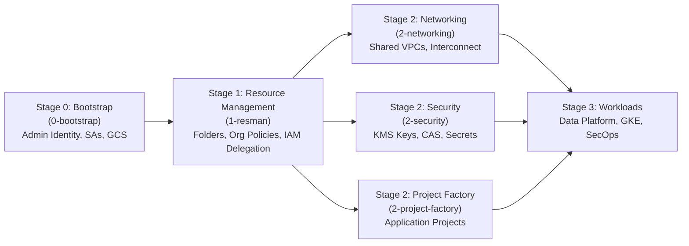

# Google Cloud Foundation Fabric (FAST) - Stage 1 (Resource Management) Example

This repository provides a clean, self-contained Terraform example implementing **Google FAST Stage 1** (**Resource Management** / `1-resman`).

---

## 1. What is Google FAST?

**FAST (Foundations Architecture Setup and Templates)** is Google Cloud's opinionated, modular framework for building enterprise-grade landing zones via Infrastructure-as-Code (Terraform), maintained under [Cloud Foundation Fabric](https://github.com/GoogleCloudPlatform/cloud-foundation-fabric).

FAST structures a Google Cloud landing zone into sequential stages:



> **Note on FAST Versions**:
> - **Classic FAST (`1-resman`)**: Stage 1 creates the resource hierarchy (folders), org policies, and delegates permissions to downstream service accounts.
> - **Modern FAST (v44+)**: Combines bootstrap and resource management into YAML-driven `0-org-setup`, shifting Stage 1 to `1-vpcsc` (VPC Service Controls).
> - This example implements the **core Resource Management pattern (`1-resman`)**, which forms the foundation of all FAST hierarchy designs.

---

## 2. What Stage 1 Does

Stage 1 is executed by the **Resource Management service account** (`fast-stage1-resman`) created during Stage 0. It handles:

1. **Resource Hierarchy Creation**:
   - `Networking` folder: Shared VPC host projects, interconnect, routing.
   - `Security` folder: Centralized KMS encryption keys, Certificate Authority Service (CAS), Secret Manager.
   - `Common` folder: Shared tooling, CI runners, container registries.
   - `Workloads` folder: Sub-folders for `Development` and `Production` application environments.

2. **IAM Delegation (Least Privilege)**:
   - Grants the **Networking Automation SA** permissions on the `Networking` folder (`roles/compute.xpnAdmin`, `roles/resourcemanager.folderAdmin`, `roles/resourcemanager.projectCreator`).
   - Grants the **Security Automation SA** permissions on the `Security` folder (`roles/cloudkms.admin`, `roles/resourcemanager.folderAdmin`, `roles/resourcemanager.projectCreator`).
   - Grants the **Project Factory SA** permissions on the `Workloads` folder (`roles/resourcemanager.projectCreator`).

3. **Organization Policies (Guardrails)**:
   - `iam.disableServiceAccountKeyCreation`: Prevents downloading static SA keys; forces Workload Identity and short-lived credentials.
   - `compute.disableSerialPortAccess`: Prevents interactive serial console access to VMs.
   - `compute.requireOsLogin`: Enforces centralized IAM-based OS Login SSH authentication.
   - `iam.automaticIamGrantsForDefaultServiceAccounts`: Prevents broad Editor roles from being granted automatically to default service accounts.

4. **Resource Manager Hierarchical Tags**:
   - Tag keys for `context` (`networking`, `security`, `workloads`) and `environment` (`development`, `production`).
   - Attached to corresponding folders for conditional IAM and audit controls.

5. **Stage Contract Outputs**:
   - Emits folder IDs and configuration objects ready for ingestion by Stage 2.

---

## 3. File Structure

| File | Purpose |
| :--- | :--- |
| [`versions.tf`](./versions.tf) | Terraform required version, Google providers, and impersonation settings |
| [`variables.tf`](./variables.tf) | Input variables (org ID, billing account, stage 0 automation SAs, admin groups) |
| [`folders.tf`](./folders.tf) | Google Cloud folder definitions (Networking, Security, Common, Workloads) |
| [`iam.tf`](./iam.tf) | Scoped IAM delegations to downstream stage automation SAs and admin groups |
| [`org_policies.tf`](./org_policies.tf) | Baseline security organization policies |
| [`tags.tf`](./tags.tf) | Hierarchical Resource Manager Tag keys, values, and folder bindings |
| [`outputs.tf`](./outputs.tf) | Exported folder IDs and Stage 2 contract variables |
| [`terraform.tfvars.example`](./terraform.tfvars.example) | Example variable values |
| [`fabric_module_example.tf.example`](./fabric_module_example.tf.example) | Reference using Cloud Foundation Fabric `modules/folder` |

---

## 4. How to Use

### Step 1: Prepare variables
Copy `terraform.tfvars.example` to `terraform.tfvars`:
```bash
cp terraform.tfvars.example terraform.tfvars
```
Update the values:
- `organization_id`: Your GCP Organization ID.
- `stage0_automation_service_accounts`: The service accounts provisioned by Stage 0 (or your deployment identities).
- `admin_principals`: Your organization's Google Groups.

### Step 2: Initialize Terraform
```bash
terraform init
```

### Step 3: Review Plan
```bash
terraform plan
```

### Step 4: Apply Configuration
```bash
terraform apply
```

### Step 5: Passing Outputs to Stage 2
Stage 1 outputs the folder IDs and parameters required by Stage 2:
```bash
terraform output -json stage2_networking_inputs > 2-networking.auto.tfvars.json
terraform output -json stage2_security_inputs > 2-security.auto.tfvars.json
terraform output -json stage2_project_factory_inputs > 2-project-factory.auto.tfvars.json
```
These can be directly referenced by `2-networking`, `2-security`, and `2-project-factory` to deploy infrastructure into their designated folders.
