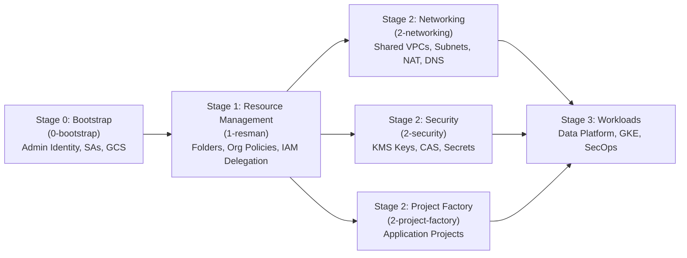
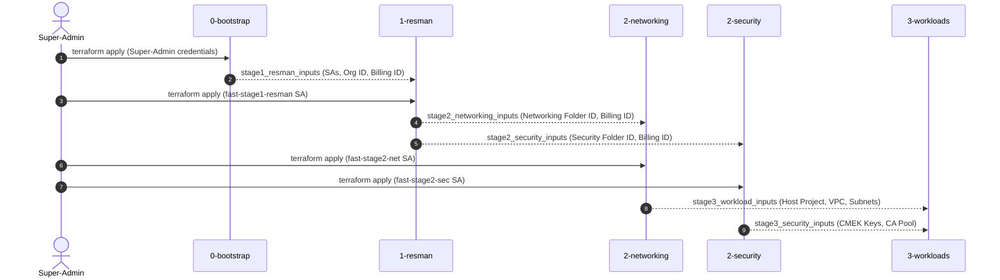

# Google Cloud Foundation Fabric (FAST) - Enterprise Landing Zone

This repository provides clean, modular, and self-contained Terraform implementations of the core stages of **Google Cloud Foundation Fabric (FAST)**.

---

## 1. What is Google FAST?

**FAST (Foundations Architecture Setup and Templates)** is Google Cloud's opinionated framework for enterprise landing zones via Infrastructure-as-Code (Terraform), maintained under [Cloud Foundation Fabric](https://github.com/GoogleCloudPlatform/cloud-foundation-fabric).

FAST splits infrastructure into isolated stages executed by dedicated service accounts enforcing the principle of least privilege:



---

## 2. Implemented Stages

| Stage | Directory | Description |
| :--- | :--- | :--- |
| **Stage 0** | [`0-bootstrap/`](./0-bootstrap) | **Bootstrap**: Seeds the automation project, provisioned GCS state buckets for all stages, stage automation service accounts, organization & billing IAM grants, and impersonation. |
| **Stage 1** | [`1-resman/`](./1-resman) | **Resource Management**: Constructs the folder hierarchy (`Networking`, `Security`, `Common`, `Workloads`), applies organization policies, binds hierarchical tags, and delegates scoped folder permissions to stage SAs. |
| **Stage 2** | [`2-networking/`](./2-networking) | **Networking**: Provisions the Shared VPC host project, custom VPC network, subnets with Private Google Access (PGA) and secondary GKE ranges, regional Cloud Routers and NAT, baseline firewalls, and Private Cloud DNS. |
| **Stage 2** | [`2-security/`](./2-security) | **Security**: Provisions the centralized security core project, regional Cloud KMS Key Rings with automated CMEK rotation (compute, storage, bigquery, gke), Secret Manager, and Private CA Service (CAS). |

---

## 3. End-to-End Execution Workflow

FAST uses **stage contract outputs** to decouple stages while passing required parameters seamlessly without manual configuration.



### Step 1: Deploy Stage 0 (Bootstrap)
Stage 0 is applied once using human Super-Admin credentials (`Organization Admin` + `Billing Account Admin`):
```bash
cd 0-bootstrap
cp terraform.tfvars.example terraform.tfvars
# Update organization_id and billing_account_id
terraform init
terraform plan
terraform apply
```

Export contract outputs for Stage 1:
```bash
terraform output -json stage1_resman_inputs > ../1-resman/1-resman.auto.tfvars.json
```

---

### Step 2: Deploy Stage 1 (Resource Management)
Stage 1 ingests `1-resman.auto.tfvars.json` automatically:
```bash
cd ../1-resman
terraform init
terraform plan
terraform apply
```

Export contract outputs for Stage 2 (Networking & Security):
```bash
terraform output -json stage2_networking_inputs > ../2-networking/2-networking.auto.tfvars.json
terraform output -json stage2_security_inputs > ../2-security/2-security.auto.tfvars.json
```

---

### Step 3: Deploy Stage 2 (Networking)
Stage 2 ingests `2-networking.auto.tfvars.json` automatically:
```bash
cd ../2-networking
terraform init
terraform plan
terraform apply
```

Export contract outputs for downstream Stage 3 Workloads:
```bash
terraform output -json stage3_workload_inputs > ../3-workloads.auto.tfvars.json
```

---

### Step 4: Deploy Stage 2 (Security)
Stage 2 Security ingests `2-security.auto.tfvars.json` automatically:
```bash
cd ../2-security
terraform init
terraform plan
terraform apply
```

Export contract outputs for downstream Stage 3 Workloads:
```bash
terraform output -json stage3_security_inputs > ../3-security.auto.tfvars.json
```

---

## 4. Repository Structure

```text
fast-test/
├── 0-bootstrap/              # Stage 0: Automation project, state buckets, SAs, IAM
│   ├── versions.tf
│   ├── variables.tf
│   ├── project.tf
│   ├── storage.tf
│   ├── iam.tf
│   ├── outputs.tf
│   ├── terraform.tfvars.example
│   ├── fabric_module_example.tf.example
│   └── README.md
├── 1-resman/                 # Stage 1: Resource hierarchy, org policies, tags, delegation
│   ├── versions.tf
│   ├── variables.tf
│   ├── folders.tf
│   ├── iam.tf
│   ├── org_policies.tf
│   ├── tags.tf
│   ├── outputs.tf
│   ├── terraform.tfvars.example
│   ├── fabric_module_example.tf.example
│   └── README.md
├── 2-networking/             # Stage 2: Shared VPC host, subnets, NAT, firewall, DNS
│   ├── versions.tf
│   ├── variables.tf
│   ├── project.tf
│   ├── vpc.tf
│   ├── subnets.tf
│   ├── nat.tf
│   ├── firewall.tf
│   ├── dns.tf
│   ├── outputs.tf
│   ├── terraform.tfvars.example
│   ├── fabric_module_example.tf.example
│   └── README.md
├── 2-security/               # Stage 2: Centralized KMS CMEK keys, Secret Manager, CAS
│   ├── versions.tf
│   ├── variables.tf
│   ├── project.tf
│   ├── kms.tf
│   ├── secret_manager.tf
│   ├── ca_service.tf
│   ├── outputs.tf
│   ├── terraform.tfvars.example
│   ├── fabric_module_example.tf.example
│   └── README.md
├── resources/                # Architectural diagrams and reference materials
└── README.md                 # Master landing zone documentation
```

